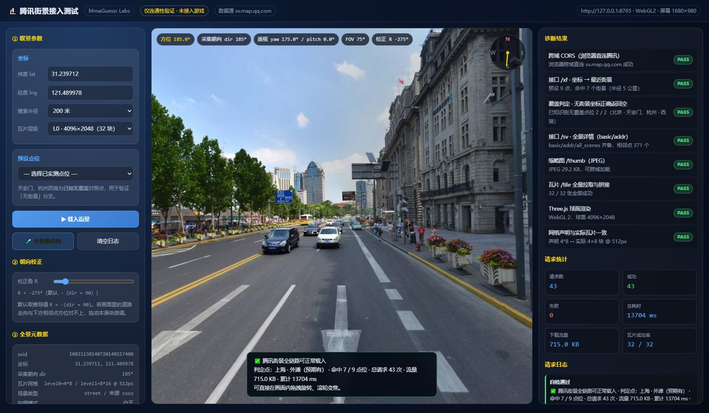
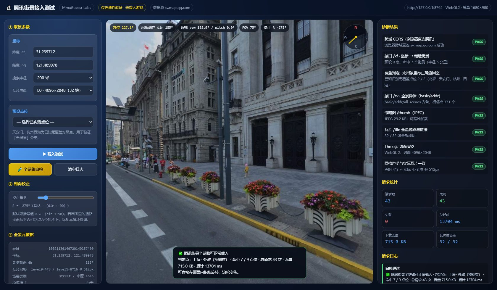
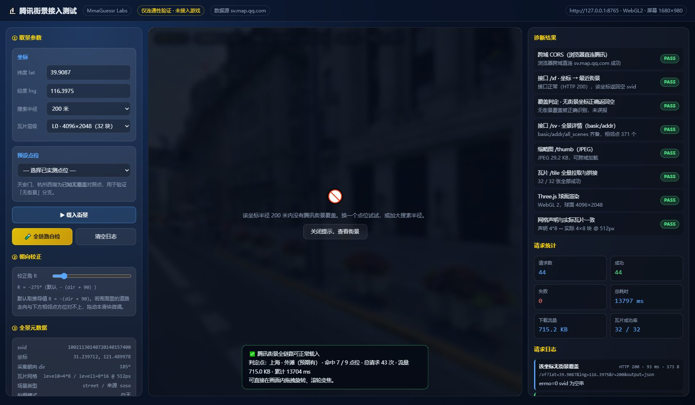

# 腾讯街景接入可行性测试（MmaGuessr Labs）

> 这是一个**独立测试页**，用来验证腾讯街景（QQ Map Street View）能否作为 MmaGuessr 的第二个街景数据源正常载入。
>
> **它不参与游戏运行**：不在 `src/` 下、不被 `frontend/index.html` 或任何游戏页面引用、不在 `.github/workflows/deploy.yml` 的发布产物 `_site` 中，因此不会被部署到线上站点，也没有改动任何游戏代码或版本号。

---

## 1. 这个测试页解决什么问题

MmaGuessr 目前唯一的数据源是 Mapillary。要判断能否换/加源，需要先回答四个问题：

| # | 问题 | 本测试页如何回答 |
| --- | --- | --- |
| 1 | 腾讯街景的数据接口是什么？第三方查看器 `qq-map.netlify.app` 在调什么？ | 静态逆向其前端产物，定位到腾讯官方域名 |
| 2 | 浏览器能否跨域直连？ | 页面在 `localhost` 下发起真实请求并记录 HTTP 状态 |
| 3 | 全景图能不能拼出可用的 360° 画面？ | 拉取全部瓦片拼成 equirect 全景并渲染 |
| 4 | 「有覆盖 / 无覆盖」能不能正确区分？ | 用已知无覆盖点位（天安门、西湖）做对照组 |

---

## 2. 接口从哪里来（逆向过程）

1. 抓 `https://qq-map.netlify.app/` 的 HTML，得到三个打包产物：`assets/index-*.js`、`assets/pano-*.js`、`assets/leaflet-*.js`。
2. 在 `index-Dc33xBYI.js` 中检索到字符串常量：

   ```js
   Rn = `https://sv.map.qq.com`                       // 官方街景接口
   zn = `https://qq-api-proxy.map-making.app`         // 第三方公共代理（备用）
   ```

   以及两个 URL 构造函数：

   ```js
   `${Rn}/xf?lat=${t}&lng=${e}&r=${n}&output=json`    // 坐标 → 最近街景
   `${Rn}/sv?svid=${e}&output=json`                   // svid → 全景详情
   `https://sv1.map.qq.com/thumb?from=web&svid=${e}&level=0&x=0&y=0`
   `https://sv1.map.qq.com/tile?from=web&svid=${e}&level=${t}&x=${n}&y=${r}`
   ```

3. 该查看器用 Photo Sphere Viewer 渲染，配置里写明了层级划分：

   ```js
   levels: [
     { width: 4096, cols: 8,  rows: 4  },
     { width: 8192, cols: 16, rows: 8  },
   ]
   ```

   → 结果是 **2:1 的等距圆柱投影（equirectangular）**，不是立方体贴图。

4. 请求最终指向腾讯官方域名，**不依赖该第三方站点**；netlify 站点仅作为接口线索来源。

---

## 3. 接口规格

### 3.1 `GET https://sv.map.qq.com/xf` — 坐标找街景

| 参数 | 必填 | 说明 |
| --- | --- | --- |
| `lat` | 是 | 纬度（WGS84） |
| `lng` | 是 | 经度（WGS84） |
| `r` | 是 | 搜索半径，单位米 |
| `output` | 是 | 固定 `json` |

响应：`application/javascript;charset=GBK`（**注意是 GBK，不是 UTF-8**）

```json
{
  "info": { "errno": 0, "type": 1, "error": 0 },
  "detail": { "svid": "10021130140720140157400", "x": 0, "y": 0, "heading": 0, "type": 0, ... }
}
```

> ⚠️ `errno === 0` 只表示**请求成功**，不代表有街景。该点无覆盖时 `detail.svid` 是**空字符串**而非 `null`，调用方必须显式判空。

### 3.2 `GET https://sv.map.qq.com/sv` — 全景详情

| 参数 | 必填 | 说明 |
| --- | --- | --- |
| `svid` | 是 | 街景 ID |
| `output` | 是 | 固定 `json` |

响应顶层是 `{ info, detail }`，有效数据在 **`detail`** 下：

| 字段 | 类型 | 说明 |
| --- | --- | --- |
| `detail.basic` | object | 全景核心元数据（见下） |
| `detail.addr` | object | `{ x_lng, y_lat }` 全景真实经纬度 |
| `detail.all_scenes` | array | 相邻采集点，元素 `{ x, y, svid, dy }`（`x`/`y` 为 Web Mercator 米） |
| `detail.history` | object | `{ nodes: [{ default, svid }] }` 历史采集版本 |
| `detail.region` | object | `{ entrances: [{ name, svid, rex, rey, svx, svy, icon }] }` 附近地标入口 |
| `detail.roads` | array | 道路折线，含 `name` / `width` / `points` |
| `detail.vpoints` | array | 虚拟游览点位与 `link` 链 |
| `detail.markers` | array | 标注点（实测为空） |

`detail.basic` 关键字段：

| 字段 | 示例 | 说明 |
| --- | --- | --- |
| `svid` | `10021130140720140157400` | 街景 ID，第 9–18 位编码采集时间 `YY MM DD HH mm` |
| `x` / `y` | `13524202.49` / `3663919.61` | Web Mercator 米 |
| `dir` | `"185"` | 采集朝向，罗盘度（0=正北，顺时针） |
| `mode` | `"day"` | 白天 / `night` |
| `type` | `"street"` | 场景类型 |
| `source` | `"soso"` | 数据来源。`soso` 即腾讯地图前身「搜搜地图」，可佐证这是腾讯自有街景数据 |
| `level0` / `level1` | `"4*8"` / `"8*16"` | `行*列` 瓦片网格 |
| `tile_width` / `tile_height` | `"512"` / `"512"` | 单块瓦片像素 |
| `append_addr` | `"中山东一路"` | 道路名 |
| `sno` | `"GS(2018)1865号"` | 审图号 |
| `proj_type` | `"1"` | 投影类型，1 为 equirect |

### 3.3 `GET https://sv1.map.qq.com/tile` — 全景瓦片

| 参数 | 说明 |
| --- | --- |
| `from` | 固定 `web` |
| `svid` | 街景 ID |
| `level` | `0` → 8×4=32 块 4096×2048；`1` → 16×8=128 块 8192×4096 |
| `x` / `y` | 列 / 行（从 0 开始） |

返回 `image/jpeg`。拼接顺序为 `drawImage(tile, x*512, y*512)`，即 x 是列、y 是行。

`GET https://sv1.map.qq.com/thumb?from=web&svid=&level=0&x=0&y=0` 返回该全景的单张缩略图 JPEG，适合做封面或快速探活。

---

## 4. 朝向校正

全景图的水平中心（`u = 0.5`）对应采集车行进方向 `basic.dir`。要把「看到的方向」和「现实方位」对齐，需要对球体做一次绕 Y 轴的旋转 `R`。

按 Three.js 的球体 UV 与默认相机朝向（`-Z`）推导：画面内容对应的罗盘方位为 `dir + 90 + R - θ`（`θ` 为相机 yaw），而相机自身朝向的罗盘方位是 `-θ`；两者相等 ⇒

```
R = -(dir + 90)
```

该式依赖「`u = 0.5` ↔ `dir`」这一字段语义推断，因此测试页把 `R` 做成**可调滑块**，默认填入推导值，允许实测微调。页面左下角显示实时方位，右侧列出最近邻采集点及其方位角，可用来核对「画面中路的方向」与「相邻点方位」是否一致。

---

## 5. 已知限制

| 项 | 说明 |
| --- | --- |
| 覆盖范围 | 仅中国**部分城市道路**有覆盖。实测天安门、杭州西湖等点位确无数据；这是腾讯侧的采集范围问题，不是接口故障 |
| 非官方接口 | 接口未公开文档、无 SLA、无鉴权。腾讯随时可能调整或下线。**据此做产品决策需自行承担风险** |
| 版权与合规 | 街景影像版权归腾讯所有。正式用于公开产品前必须确认授权与审图号（`sno`）要求 |
| `detail.region.entrances` | 会返回「和平饭店」这类**地名**。若接入游戏，必须先剔除该字段，否则直接泄露答案 |
| HEAD 请求 | 服务器对 `HEAD` 返回 500；浏览器 `GET`（`fetch`/``）不受影响 |
| 分辨率上限 | `level1` 为 8192×4096（128 块），拼成单张 canvas 会占用约 128 MB 显存，低端设备慎用；`level0` 足够验证 |
| 采集时间 | 实测多数点位为 2014–2016 年，画面偏旧 |

---

## 6. 如何运行

纯静态页面，但 `file://` 下 `fetch` 跨域会被浏览器拦，必须走 HTTP：

```bash
# 在本目录下起任意静态服务器
python -m http.server 8765
# 然后打开 http://127.0.0.1:8765/index.html
```

页面提供两个入口：

- **载入街景**：按当前坐标查询并渲染
- **全链路自检**：对 9 个预设点位跑完整链路（7 个预期有覆盖 + 2 个预期无覆盖），逐项输出 PASS/FAIL

右侧诊断面板会记录每一次请求的 URL、HTTP 状态、耗时与字节数，便于定位问题。

---

## 7. 文件说明

| 文件 | 职责 |
| --- | --- |
| `index.html` | 页面骨架与样式（深色玻璃质感，与主站视觉一致） |
| `qq-sv.js` | 接口客户端：`/xf`、`/sv`、`/thumb`、`/tile`，含 GBK 解码、超时、主机回退、瓦片拼接 |
| `pano-viewer.js` | Three.js 球面全景查看器：拖拽旋转、滚轮变焦、朝向校正 |
| `app.js` | 页面逻辑：诊断面板、统计、自检流程、元数据渲染 |

依赖：`three@0.149.0`（unpkg CDN，与主站使用同一版本与 SRI 哈希）。

---

## 8. 实测记录（2026-09-30）

**环境**：Windows / Chrome（Playwright 驱动，`channel=chrome`）/ 视口 1680×980 / 页面通过 `http://127.0.0.1:8765` 访问

**执行**：页面「🧪 全链路自检」——对 9 个预设点位逐一探测，再对首个命中点位跑完整加载与渲染

### 8.1 结论：全链路可用

| # | 检查项 | 结果 | 实测数据 |
| --- | --- | --- | --- |
| 1 | 跨域 CORS（浏览器直连腾讯） | **PASS** | 从 `127.0.0.1` 直连 `sv.map.qq.com` 成功，无需代理 |
| 2 | 接口 `/xf` 坐标 → 街景 | **PASS** | 9 点命中 7 个（半径 5 km，单次约 90–300 ms） |
| 3 | 覆盖判定（无街景坐标） | **PASS** | 天安门、西湖 2/2 正确识别为空 `svid`，未误报 |
| 4 | 接口 `/sv` 全景详情 | **PASS** | `basic` / `addr` / `all_scenes`(371 点) / `history`(3 版) 齐备 |
| 5 | 缩略图 `/thumb` | **PASS** | 一次请求取回 JPEG 29.2 KB，可跨域加载 |
| 6 | 瓦片 `/tile` 全量拉取与拼接 | **PASS** | L0 共 32/32 张全部成功，无缺块 |
| 7 | Three.js 球面渲染 | **PASS** | WebGL 2，球面贴图 4096×2048；像素取样平均亮度 109.1、8 个亮度层级（非空白帧） |
| 8 | 网格声明与实际瓦片一致 | **PASS** | `basic.level0 = "4*8"` ↔ 实际 4 行 8 列 @ 512px |

**请求统计**：43 次请求 / 43 次成功 / 0 失败 / 累计 13.7 s / 下载 715 KB（含 32 张瓦片）
**浏览器控制台**：无错误、无失败请求

### 8.2 截图

自检通过，上海外滩中山东一路街景完整渲染（右下角为校验采集车车头，属正常现象）：



拖拽旋转至西南 227°，画面转为外滩建筑群近景，交互正常、无拼接错位：



无覆盖对照点（天安门坐标）——注意日志里 `HTTP 200 / errno=0` 但 `svid 为空串`，这正是该接口最容易误判的地方：



### 8.3 朝向校正已实证

推导值 `R = -(dir + 90)` 不是猜的，用地理事实做了交叉验证：

- 该点位 `dir = 185°`（近乎正南），初始视角设为方位 185°；
- 画面中央恰为**道路向南延伸的消失点**；
- 画面**右侧**出现外滩万国建筑群——这批建筑实际位于中山东一路**西侧**，朝南看时西侧应在右手边，**与画面一致**。

同时 `/sv` 返回的最近邻采集点方位为 185°（正南 3.2 m）与 8°（正北 3.9 m），恰好构成南北向道路，与 `dir` 及画面走向完全吻合。

### 8.4 对「接入游戏」的判断

| 维度 | 判断 |
| --- | --- |
| 技术可行性 | ✅ 可行。接口直连、无需密钥、CORS 开放、数据可拼成标准 equirect 全景 |
| 覆盖范围 | ⚠️ 仅中国部分城市道路。作为「中国模式」的补充源有意义，无法替代全球覆盖的 Mapillary |
| 画面年份 | ⚠️ 实测点位多为 2014–2016 年采集，显著早于 Mapillary 的近年影像 |
| 风险 | ⚠️ 非官方接口，无文档与 SLA；商用需先解决影像授权与审图号合规 |
| 接入成本 | 需要新增一套瓦片加载器（现有 Mapillary 查看器无法直接复用）；且必须在服务端剔除 `region.entrances` 等泄露答案的字段 |

**本次仅验证可行性，未做任何接入改动。** 若无后续动作，这个目录可以整体删除，不影响游戏。

